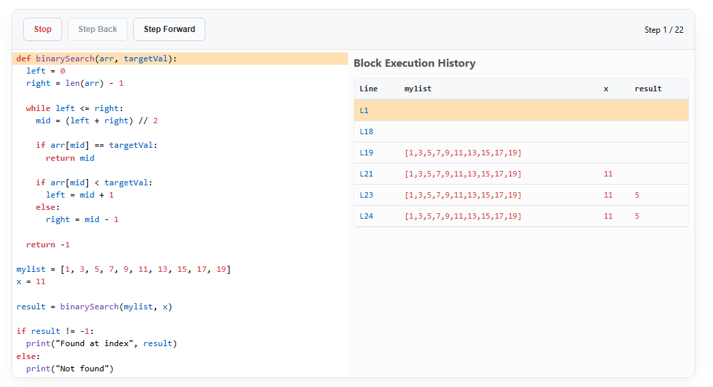

# Python Code Inspector

Visual debugger for Python code. Uses React and CodeMirror for the code editor and Pyodide to execute Python within the browser.



The debugger runs entirely in the browser, using [pyodide](https://pyodide.org/en/stable/) to execute Python code with no need for internet access.

## Running

There is no special installation process, simply:

```sh
# Install dependencies
yarn
# Run the application
yarn run dev
```